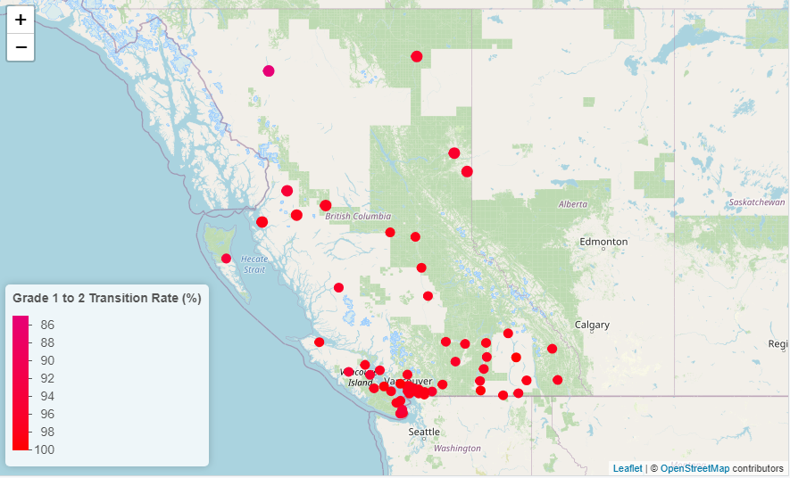
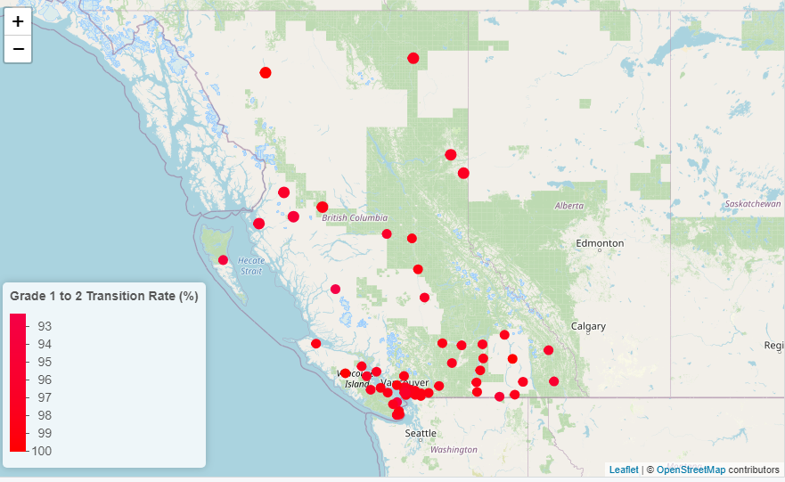
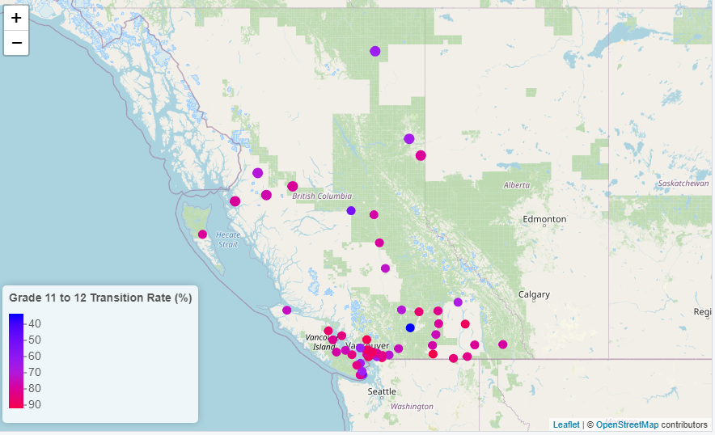
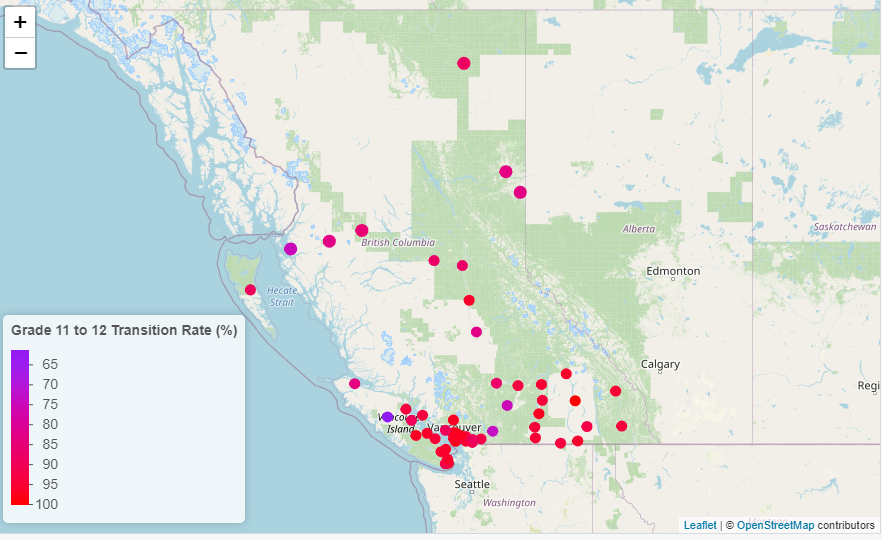

```{r setup, echo=FALSE, message=FALSE, warning=FALSE}
# Set up everything here. This is hidden from the final output
#install.packages(c("data.table","leaflet"))
library(data.table)
library(leaflet)
library(tidyverse)
library(ggplot2)
library(mgcv)

library(knitr)

library(rpart)
library(rpart.plot)
library(randomForest)
library(gbm)
library(xgboost)
library(caret)
```

## Introduction

Although test scores can be quite informative, they can be misleading--the difficulty of tests can fluctuate dramatically, effectively resulting in student grades also fluctuating. On the other hand, although grade-to-grade transition rates do not reflect the quality of the education too accurately, they are still an excellent indicator of how much support a government is providing to its youth. As such, through the use of [open data from British Columbia](https://catalogue.data.gov.bc.ca/), we sought to answer the following question:

**How has the British Columbian Government's educational support (as indicated by grade-to-grade transition rates) in the past 30 years differed in different kinds of schools, as well as for different types of British Columbian students (i.e., Indigenous? Special needs?)? Are there any other specific attributes that is strongly related to a lower/higher quality of educational support?**

Do note that this is the pdf version of the report for this project. If you wish to see the interactive web version of this report that covers things in more detail (for instance, there are interactive figures there), you can simply [click here](https://coderwarren.github.io/An-Analysis-of-BC-Grade-Transitions/). Various later parts of this PDF will reference the interactive figures of the report on the website. If you are curious about the code that was written for this investigation, you can find the github repository [here](https://github.com/CoderWarren/An-Analysis-of-BC-Grade-Transitions).

## Methods

### Data Prep

```{r read-in, echo=FALSE, message=FALSE, warning=FALSE}
# From: https://catalogue.data.gov.bc.ca/dataset/bc-schools-grade-to-grade-transition
#
# Read in the 1992 to 2001 data
data_1 <- data.table::fread("data_transitions/grtogrtransition_1992-93_to_2000-01.csv")
# Read in the 2001 to 2011 data
data_2 <- data.table::fread("data_transitions/grtogrtransition_2001-02_to_2010-11.csv")
# Read in the 2011 to 2021 data
data_3 <- data.table::fread("data_transitions/grtogrtransition_2011-12_to_2020-21.csv")

# From: https://catalogue.data.gov.bc.ca/dataset/bc-schools-school-district-information
#
# Read in the locations
locations <- data.table::fread("data_districts/current_district_office_information.csv")


# From: https://catalogue.data.gov.bc.ca/dataset/bc-schools-teacher-statistics
#
# Read in teacher "legacy" data
teacher_1 <- data.table::fread("data_districts/legacy-teacher-statistics-19911992-20162017.csv")
# Read in teacher data
teacher_2 <- data.table::fread("data_districts/bc-education-workforce-public-schools-to-2013-2021.csv")

# From: https://catalogue.data.gov.bc.ca/dataset/bc-schools-class-size
#
# Read in the class size data
class_sizes <- data.table::fread("data_schools/class_size_2006-07_to_2021-22.csv")
```

```{r data-prep-1, echo=FALSE, message=FALSE, warning=FALSE, results=FALSE}
# Here, we prepare the merged data set

# Combine all the data
data <- rbind(data_1, data_2, data_3)

# Remove all missing values
data <- data[!(data$DENOMINATOR_STUDIED_COHORT=="Msk"|
                 data$NUMERATOR_NUM_SUCCESSFUL=="Msk"|
               data$G2G_TRANSITION_RATE=="Msk"),]

# Make an integer variable storing the year
data$year <- strtoi(substr(data$SCHOOL_YEAR, 1, 4))

# Make the grade to grade transition rates a float
data$rate <- as.double(data$G2G_TRANSITION_RATE)

# Make the number of students an integer
data$num_students <- as.integer(data$DENOMINATOR_STUDIED_COHORT)

# Make the number of students who successfully moved on an integer
data$num_successful <- as.integer(data$NUMERATOR_NUM_SUCCESSFUL)

# Make the student grade a factor
data$grade <- as.factor(data$STUDENT_GRADE)

# Drop the unnecessary columns
data <- subset(data, select=-c(BASE_YEAR, SCHOOL_YEAR, G2G_TRANSITION_RATE,
                               MEASURE_NAME, DENOMINATOR_STUDIED_COHORT,
                               NUMERATOR_NUM_SUCCESSFUL, STUDENT_GRADE,
                               DISTRICT_NAME))
```

```{r data-prep-2, echo=FALSE, message=FALSE, warning=FALSE, results=FALSE}
data %>% 
  filter(DATA_LEVEL == "Province Level") %>%
  filter(FACILITY_TYPE == "All Facility Types") -> data_province
```

```{r data-prep-3, echo=FALSE, message=FALSE, warning=FALSE, results=FALSE}
# Drop all the rows in our table regarding data on a "Province Level"
# This is because we will not use it for the remainder of the assignment
data_district <- data %>% filter(DATA_LEVEL == "District Level")
data_district$district <- as.integer(data_district$DISTRICT_NUMBER)

# Now that we're on a district level, we can use the location data
data_district <- left_join(x=data_district, y=locations, 
                           by=c("district" = "DISTRICT_NUMBER"))

# Drop columns that aren't used
data_district <- subset(data_district, select=-c(
  DISTRICT_PROVINCE, DISTRICT_POSTAL_CODE, 
  DISTRICT_PHONE_NUMBER, DISTRICT_WEBSITE,
  SCHOOL_YEAR))

# Turn our district into a factor variable
data_district$district <- as.factor(data_district$district)

# Check what we have
summary(data_district)
```

```{r data-prep-4, echo=FALSE, message=FALSE, warning=FALSE, results=FALSE}
# Prepare the data for data_school from the main data set
data_school <- data %>% filter(DATA_LEVEL == "School Level")
data_school$district <- as.integer(data_school$DISTRICT_NUMBER)

# Prepare the class_sizes dataset for merging
class_sizes$year <- strtoi(substr(class_sizes$SCHOOL_YEAR, 1, 4))
c_size_merge <- class_sizes %>%
  filter(DATA_LEVEL == "School Level") %>%
  select(-c(DATA_LEVEL, DISTRICT_NUMBER, SCHOOL_NAME,
            PUBLIC_OR_INDEPENDENT))
# Prepare data for Machine Learning. Merge our school data with the class sizes
ML_school_data <- left_join(x=data_school, y=c_size_merge,
                            by=c("SCHOOL_NUMBER" = "SCHOOL_NUMBER",
                                 "year" = "year")) %>%
  filter(year >= min(c_size_merge$year)) %>%
  filter(PUBLIC_OR_INDEPENDENT == "BC Public School") %>%
  select(-c(NUM_OF_SCHOOLS_IN_DATA_LEVEL, SCHOOL_YEAR, DISTRICT_NUMBER,
            FACILITY_TYPE))
# Use the correct average for the correct grade groupp
ML_school_data <- ML_school_data %>%
  mutate(AVG_CLASS_SIZE_GRADE_GROUP =
           case_when(
             ML_school_data$grade==1 ~ AVG_CLASS_SIZE_1_3,
             ML_school_data$grade==2 ~ AVG_CLASS_SIZE_1_3,
             ML_school_data$grade==3 ~ AVG_CLASS_SIZE_1_3,
             ML_school_data$grade==4 ~ AVG_CLASS_SIZE_4_7,
             ML_school_data$grade==5 ~ AVG_CLASS_SIZE_4_7,
             ML_school_data$grade==6 ~ AVG_CLASS_SIZE_4_7,
             ML_school_data$grade==7 ~ AVG_CLASS_SIZE_4_7,
             ML_school_data$grade==8 ~ AVG_CLASS_SIZE_8_12,
             ML_school_data$grade==9 ~ AVG_CLASS_SIZE_8_12,
             ML_school_data$grade==10 ~ AVG_CLASS_SIZE_8_12,
             ML_school_data$grade==11 ~ AVG_CLASS_SIZE_8_12,
           )) %>%
  select(-c(AVG_CLASS_SIZE_K, AVG_CLASS_SIZE_1_3, 
            AVG_CLASS_SIZE_4_7, AVG_CLASS_SIZE_8_12))
# Replace the suitable NAs with 0s
ML_school_data$TOTAL_CLASSES_GREATER_30[is.na(ML_school_data$TOTAL_CLASSES_GREATER_30)] <- 0
ML_school_data$TOTAL_WITH_EA[is.na(ML_school_data$TOTAL_WITH_EA)] <- 0
ML_school_data <- na.omit(ML_school_data)
# Modify the teacher_1 datAset to have a year attribute
teacher_1$year <- strtoi(substr(teacher_1$`SCHOOL YEAR`, 1, 4))
# Prepare an intermediate dataset so merging goes smoothly
teacher_1 %>%
  filter(GENDER=="All") %>%
  filter(`Educators CATEGORY`=="Educators") %>%
  filter(`DATA LEVEL`=="DISTRICT LEVEL") %>%
  select(c(year, `DISTRICT NUMBER`, `FULLTIME Educators CNT`,
           `PARTIME Educators CNT`)) -> teacher_merge
teacher_merge$`FULLTIME Educators CNT`[is.na(teacher_merge$`FULLTIME Educators CNT`)] <- 0
teacher_merge$`PARTIME Educators CNT`[is.na(teacher_merge$`PARTIME Educators CNT`)] <- 0  
teacher_merge$`DISTRICT NUMBER` <- as.integer(teacher_merge$`DISTRICT NUMBER`)
ML_school_data <- left_join(x=ML_school_data, y=teacher_merge,
                            by=c("district" = "DISTRICT NUMBER",
                                 "year" = "year"))
ML_school_data$`FULLTIME Educators CNT` <- strtoi(ML_school_data$`FULLTIME Educators CNT`)
ML_school_data$`PARTIME Educators CNT` <- strtoi(ML_school_data$`PARTIME Educators CNT`)
```

All the data that was used in this assignment was from [British Columbia open data](https://catalogue.data.gov.bc.ca/), and all the files that we used came in the form of '.csv' files. The main data set we used was [the 1992-2021 data on grade-to-grade transition rates published by British Columbia Education Analytics](https://catalogue.data.gov.bc.ca/dataset/bc-schools-grade-to-grade-transition). Additional data was needed for machine learning, so we also used [a dataset on class Sizes from 2006 to 2021](https://catalogue.data.gov.bc.ca/dataset/bc-schools-class-size), [a dataset regarding British Columbian Teachers for each district from 1991 to 2016](https://catalogue.data.gov.bc.ca/dataset/bc-schools-teacher-statistics), and [a dataset with information regarding each district's 2018/19 office](https://catalogue.data.gov.bc.ca/dataset/bc-schools-school-district-information). As all of our data comes from the British Columbian open data portal and is regarding the British Columbian education system, they all share a similar format--the data is separated into a provincial, district and school level, and it shares common "IDs" for certain variables, such as "School_Numbers". It is worth noting that few of the files were tidy--many of the files had some rows that recorded data on "all students" whilst other rows recorded data on "Indigenous students", so each row should not be treated as its own observation. As such, we had to be careful when working with it. We merged and filtered the data from all of the files into three data tables--one for the provincial level, one for the district level, and one for the school value. Rather than imputing, we removed entries in our table with missing data, as I felt as though imputation would lead to my figures being misleading.

\newpage

### Procedure

Before doing anything meaningful, we should first do some exploratory data analysis. Based on the structure of the data, I felt as though it would be most appropriate to look at the situation from all three levels. We begin by making interactive figures to understand the situation from a provincial and district level. We will also perform basic model fitting on a school level. By mimicking the structure of our data, we can make the most out of it! Our data exploration is primarily for the purpose of answering our first question: **How has the British Columbian Government's educational support (as indicated by grade-to-grade transition rates) in the past 30 years differed in different kinds of schools, as well as for different types of British Columbian students (i.e., Indigenous? Special needs?)?**

After doing some basic Exploratory Data Analysis, we will fit some machine learning models (namely regression trees, bagging, random forests, boosting and extreme gradient boosting) on a school level, as there are not enough features or number of observations on the district and provincial levels to fit these machine-learning models in a meaningful way. The primary focus of this section is to answer our second question: **Are there any other specific attributes that are strongly related to a lower/higher quality of educational support?**

## Results

### Exploratory Data Analysis

Let us begin with some exploratory data analysis. [You can find the interactive figures **on the website** here.](https://coderwarren.github.io/An-Analysis-of-BC-Grade-Transitions/#Exploratory_Data_Analysis) We will explore the data on the provincial level, district level, and school level.

[Figure 1 **from our website** is an interactive figure that allows you to do Exploratory Data Analysis on a Provincial Level](https://coderwarren.github.io/An-Analysis-of-BC-Grade-Transitions/#Exploratory_Data_Analysis). Overall, as time went by, the percentage of students that successfully transitioned to the next grade increased. This is the most prominent for students in grades 8-11. It is also worth noting that the percentage of students in grades 10/11 that successfully transition to the next grade are significant lower than the percentage of students in the lower grades that successfully transition.

```{r plot1, echo=FALSE, message=FALSE, warning=FALSE, fig.cap=" A graph depicting the percentage of students in BC of each grade level that successfully transition to the next grade between the years 1993 and 2020.", eval=FALSE}
# Plot for province total
data %>% 
  filter(DATA_LEVEL == "Province Level") %>%
  filter(PUBLIC_OR_INDEPENDENT == "Province - Total") %>%
  filter(SUB_POPULATION == "All Students") %>%
  filter(FACILITY_TYPE == "All Facility Types") %>%
  ggplot(aes(x=year, y=rate, color=grade)) +
  geom_line() +
  xlab("Year") +
  ylab("Percentage of BC Students who Transitioned to the Next Grade") +
  labs(title="Rate of successful grade transitions (1993-2020)",
       color="Student Grade Level")
```

As for specific sub-populations, if we focus on the difference in transition rates between students from public schools and independent schools, we can see that the rates of grade transitions for students of BC public schools are lower than that of BC independent schools, but the increase in the rate of successful grade transitions is significantly higher in public schools. Furthermore, private schools (i.e., independent schools) seem to have a much higher rate of transition, especially for grade levels 8 and above. This does make sense, as private schools are often times more expensive, and so the students attending them naturally live in my affluent families. Likewise, when we focus on the difference in transition rates between Indigenous and Non Indigenous students, we can see that the rate of successful grade transitions is significantly lower in Indigenous students compared to their non-Indigenous counterparts. We can also see that the increase in the rates of grade transitions over the years is higher for Indigenous students compared to non-Indigenous students. Lastly, when we focus on the difference in transition rates between Special Needs and Non Special Needs students, we can see that the rate of successful grade transitions is significantly lower in special needs students compared to students without special needs.

[Figures 2 (interactive heat map) and 3 (interactive box plot) **from the website** were made so that one could more easily explore the district level](https://coderwarren.github.io/An-Analysis-of-BC-Grade-Transitions/#Exploratory_Data_Analysis). We can see that overall, the percentage of students who transitioned to the next grade for Grade 11 fluctuates very dramatically. Playing with the interactive box plot, one can see that the variation in the rate of transitions from grade 11 to 12 from 2015 to 2020 has been significantly reduced (when compared with the past years). The median of the rates has also increased over time. As such, these plots suggest that there is more equality (due to the decrease in variation) in terms of education/opportunities across the districts, and the education/opportunities offered is of a higher quality (as indicated by the higher median). Furthermore, have a look at figures 1-4 **on this document**. The colour scale for the transition rates are the same for all four figures. Notice how figures 1 and 2 look relatively the same, while for figures 3 and 4, we can clearly see that the data points have become noticably more red. This shows us how significantly the transition rates for higher grades (like Grade 11) have increased with respect to the lower grades (like Grade 1).

Again, let us focus on specific sub-populations now, but at a district level. Playing with the settings of Figure 3, we can see that for most grades (particularly the higher grades, like grade 11) the median percentage of Indigenous students per district who transitioned is significantly lower than that of non-Indigenous students in 1993. This difference is much smaller in 2020, but the median percentage is still less. The same can be said about the variation: the interquartile range (IQR) for the Indigenous 11th graders in different districts was much larger than that of the non-Indigenous counterparts in 1993. In 2020, this different has indeed shrunk, but the IQR for the Indigenous children is still roughly twice that of their non-Indigenous counterparts. As such, we can certainly say that there's an improvement in the quality of education/opportunities for both Indigenous children and non-Indigenous children, but more work needs to be done. Likewise, the relationship between students with special needs and those without (again, particularly for the higher grades) is very similar to what was seen between Indigenous and non-Indigenous children--the variation for both of the rates decreased over time, but the variation of the rates for the students with special needs was typically higher than the rate for students with special needs. The difference now is minimal though (at least when compared to the past). The median rates for both increased over time (although there was a period of time in which the special needs rates were decreasing), but the non-special needs students had a higher median rate for a while now. That said, the difference in the median rate in 2020 was very small.

```{r map-plot-1, echo=FALSE, message=FALSE, warning=FALSE, eval=FALSE}
# Data for the first plot
data_district %>%
  filter(DATA_LEVEL == "District Level") %>%
  filter(SUB_POPULATION == "All Students") %>%
  filter(grade==1) %>%
  filter(year==1993) -> plot_data_1

# Data for the second plot
data_district %>%
  filter(DATA_LEVEL == "District Level") %>%
  filter(SUB_POPULATION == "All Students") %>%
  filter(grade==1) %>%
  filter(year==2020) -> plot_data_2

# Data for the first plot
data_district %>%
  filter(DATA_LEVEL == "District Level") %>%
  filter(SUB_POPULATION == "All Students") %>%
  filter(grade==11) %>%
  filter(year==1993) -> plot_data_3

# Data for the second plot
data_district %>%
  filter(DATA_LEVEL == "District Level") %>%
  filter(SUB_POPULATION == "All Students") %>%
  filter(grade==11) %>%
  filter(year==2020) -> plot_data_4

# Data for both
plot_data_all <- rbind(plot_data_1, plot_data_2, plot_data_3, plot_data_4)

# A function to determine the color of the points
color_me <- colorNumeric(c('blue', 'purple', 'red'),
                       domain=plot_data_all$rate[!is.na(plot_data_all$rate)],
                       na.color=NA)

# The actual plot
plot_data_1 %>%
  leaflet() %>%
  addProviderTiles('OpenStreetMap') %>%
    addCircles(lat=~Y, lng=~X, color=~color_me(rate),
               label=~paste(round(rate,2), 'Grade 1 to 2 Transition Rate'),
                            opacity=1, fillOpacity=1, radius=10000) %>%
  addLegend('bottomleft', pal=color_me, values=plot_data_1$rate,
            title="Grade 1 to 2 Transition Rate (%)", opacity=1,
            na.label=NULL)
```

```{r map-plot-2, echo=FALSE, message=FALSE, warning=FALSE, eval=FALSE}
# The actual plot
plot_data_2 %>%
  leaflet() %>%
  addProviderTiles('OpenStreetMap') %>%
    addCircles(lat=~Y, lng=~X, color=~color_me(rate),
               label=~paste(round(rate,2), 'Grade 1 to 2 Transition Rate'),
                            opacity=1, fillOpacity=1, radius=10000) %>%
  addLegend('bottomleft', pal=color_me, values=plot_data_2$rate,
            title="Grade 1 to 2 Transition Rate (%)", opacity=1,
            na.label=NULL)
```

```{r map-plot-3, echo=FALSE, message=FALSE, warning=FALSE, eval=FALSE}
# The actual plot
plot_data_3 %>%
  leaflet() %>%
  addProviderTiles('OpenStreetMap') %>%
    addCircles(lat=~Y, lng=~X, color=~color_me(rate),
               label=~paste(round(rate,2), 'Grade 11 to 12 Transition Rate'),
                            opacity=1, fillOpacity=1, radius=10000) %>%
  addLegend('bottomleft', pal=color_me, values=plot_data_3$rate,
            title="Grade 11 to 12 Transition Rate (%)", opacity=1,
            na.label=NULL)
```

```{r map-plot-4, echo=FALSE, message=FALSE, warning=FALSE, eval=FALSE}
# The actual plot
plot_data_4 %>%
  leaflet() %>%
  addProviderTiles('OpenStreetMap') %>%
    addCircles(lat=~Y, lng=~X, color=~color_me(rate),
               label=~paste(round(rate,2), 'Grade 11 to 12 Transition Rate'),
                            opacity=1, fillOpacity=1, radius=10000) %>%
  addLegend('bottomleft', pal=color_me, values=plot_data_4$rate,
            title="Grade 11 to 12 Transition Rate (%)", opacity=1,
            na.label=NULL)
```


```{r advanced-reg-1, echo=FALSE, eval=FALSE}
mod_data_1 <- data_school %>%
  filter(SUB_POPULATION=="Non Indigenous"|SUB_POPULATION=="Indigenous")

#gam_mod<- gam(rate ~ s(year, bs="cr", k=10) + SUB_POPULATION + grade + PUBLIC_OR_INDEPENDENT, #data=mod_data_1)
#summary(gam_mod)
#plot(gam_mod)

lm_mod_1 <- lm(rate ~ year + SUB_POPULATION + grade + PUBLIC_OR_INDEPENDENT, data=mod_data_1)
summary(lm_mod_1)
#plot(lm_mod_1)
```

```{r advanced-reg-2, echo=FALSE, eval=FALSE}
mod_data_2 <- data_school %>%
  filter(SUB_POPULATION=="Non Special Needs"|SUB_POPULATION=="Special Needs")

#gam_mod<- gam(rate ~ s(year, bs="cr", k=10) + SUB_POPULATION + grade + PUBLIC_OR_INDEPENDENT, #data=mod_data_2)
#summary(gam_mod)
#plot(gam_mod)

lm_mod_2 <- lm(rate ~ year + SUB_POPULATION + grade + PUBLIC_OR_INDEPENDENT, data=mod_data_2)
summary(lm_mod_2)
#plot(lm_mod_2)
```

```{r advanced-reg-3, echo=FALSE, eval=FALSE}
mod_data_3 <- data_school %>%
  filter(SUB_POPULATION=="All Students")

#gam_mod<- gam(rate ~ s(year, bs="cr", k=10) + grade + PUBLIC_OR_INDEPENDENT, #data=mod_data_2)
#summary(gam_mod)
#plot(gam_mod)

lm_mod_3 <- lm(rate ~ year + grade + PUBLIC_OR_INDEPENDENT, data=mod_data_3)
summary(lm_mod_3)
#plot(lm_mod_3)
```

As for the school level, I ended up fitting three linear models that predicted grade-to-grade transition rates (i.e., the grade-to-grade transition rate of a specific school, grade level, and a certain population). The first model further split the groups into Indigenous students and non-Indigenous students, while the second model split the group into ones with special needs and without. The third model simply dealt with all students (i.e., we did not split into subgroups). The predictors I used was the year, the grade level of interest, and whether the school was public or private. I also used the sub-population of interest as a predictor in my first two models.

Note that the point of creating these models was not to create a model for future prediction--we will do that at the machine learning section (which is below this section) instead. The models created here were purely for interpretability. As such, although my first, second, and third models had fairly low $R^2$ values, as shown in table 1 below, I was not bothered.

All of the predictors had an extremely small p-values (less than 1e-16), which hints at the fact that it is very likely that there is a difference in grade-to-grade transitions between people of different grades, between Indigenous and non Indigenous students, between special needs and non special students, and between students of public and private/independent schools. The coefficients of our models tell us more about these differences. The first model suggests that Indigenous students had a 2.502% lower mean rate of successful transitions, while our second model suggested that students with special needs have a 1.126% lower mean rate of successful transitions compared to their non-Indigenous and non-special needs counterparts, respectively. Looking at the coefficients for the grades for all of our models, we can also see that our model suggests that students in high school (BC high school starts at grade 8) are significantly less likely to transition to their next grade compared to their elementary school counterparts. This is probably due to the riskier behaviors certain high school students have, which may result them getting in all sorts of trouble. Lastly, our model suggests that the transition rate for public schools is smaller than that of private schools, but this different is fairly negligible. This provides a nice answer to our first question at a school level.

\newpage

```{r table-1, echo=FALSE, message=FALSE, warning=FALSE}
tibble(`Model` = c("Model 1: Indigenous/Non-Indigenous",
                   "Model 2: Special Needs/Non-Special Needs",
                   "Model 3: All Students"),
       `Adjusted R-Squared` = c(0.2164, 0.1542, 0.1551),
       `Residual Standard Error`=c(5.73, 5.482, 4.632),
       `Estimated Rate Increase per Year` = c(0.1513,0.133,0.089253))%>% 
  knitr::kable(caption = "Various Important Statistics from models")
```

```{r table-2, echo=FALSE, message=FALSE, warning=FALSE}
tibble(`Grade` = c("Grade 1", "Grade 2", "Grade 3", "Grade 4",
                   "Grade 5", "Grade 6", "Grade 7", "Grade 8",
                   "Grade 9", "Grade 10", "Grade 11"),
       `Model 1: Indigenous/Non-Indigenous`=c(0.1513,
                                              0.1577+0.1513,
                                              -0.09635+0.1513,
                                              0.4139+0.1513,
                                              0.5453+0.1513,
                                              0.6184+0.1513,
                                              0.4764+0.1513,
                                              -1.920+0.1513,
                                              -3.385+0.1513,
                                              -5.901+0.1513,
                                              -9.013+0.1513),
       `Model 2: Special Needs/Non-Special Needs`=c(0.133,
                                                    0.1567+0.133,
                                                    -0.4181+0.133,
                                                    0.5228+0.133,
                                                    0.7277+0.133,
                                                    0.7324+0.133,
                                                    0.6593+0.133,
                                                    -1.074+0.133,
                                                    -2.283+0.133,
                                                    -4.505+0.133,
                                                    -7.269+0.133),
       `Model 3: All Students`=c(0.089253,
                                0.186482+0.089253,
                                -0.017350+0.089253,
                                0.416452+0.089253,
                                0.555021+0.089253,
                                0.581683+0.089253,
                                0.639553+0.089253,
                                -1.246918+0.08925,
                                -2.561493+0.08925,
                                -5.153871+0.08925,
                                -8.080331+0.08925)) %>%
  knitr::kable(caption = "Estimated Grade Transition Rate (%) Increase Per Year")
```

\newpage

{width=450px}

{width=450px}

\newpage

{width=450px}

{width=450px}

\newpage

```{r check_special_needs, eval=FALSE, echo=FALSE}
unique(ML_school_data$SUB_POPULATION)
```

As we will be training a machine learning model on a dataset at the school level, it is worth doing some exploratory data analysis on that dataset. Note that as the dataset that we will use for the machine learning model is the result of merging several datasets, and as some datasets cover a different range of years, the machine learning dataset will only cover years from 2006 and 2016. [Figure 4 on the website is an interactive plot for this dataset](https://coderwarren.github.io/An-Analysis-of-BC-Grade-Transitions/#Exploratory_Data_Analysis), and it shows how the number of full time educators in a district and the average class size for a grade group in a school may be related to the grade transition rates. One observation we can make is that the lower grade transition rates are often coming from observations for relatively high grades (like grade 11) and from schools with a relatively relatively low number of students for a given grade group.

```{r yrgr-tags, echo=FALSE}
ML_school_data %>%
  mutate(yrgr = paste0("YEAR: ", ML_school_data$year, 
                       " GRADE: ", ML_school_data$grade)) %>%
    filter(year<2017) -> ML_school_data
```

### Machine Learning

Prior to feeding our data in, we removed province specific data—for instance, we removed school names and district names. This reduces overfitting, so our model can be somewhat generalized to schools outside British Columbia. Our machine learning dataset has data from 2006 to 2016--as such, my train test split involved me taking data from the final 3 years (2016, 2015, 2014) and placing them into the test dataset. Everything else was placed into the training dataset. By doing this, we are in essence predicting the "future" based on our current information. I chose to this for 3 years because this makes things roughly a 70-30 train-test split, which is typical train-test split in machine learning. Another important thing to note is that all schools examined here are public schools, as we could not access the relevant information for independent schools.

```{r data-prep-5, echo=FALSE}
ML_school_data %>%
  select(-c(district, DISTRICT_NAME, SCHOOL_NAME, 
            SCHOOL_NUMBER, DATA_LEVEL, PUBLIC_OR_INDEPENDENT, yrgr,
            num_successful)) %>%
  rename(
    fulltime_educators_cnt = `FULLTIME Educators CNT`,
    parttime_educators_cnt = `PARTIME Educators CNT`
    ) %>%
  mutate(SUB_POPULATION = as.factor(ML_school_data$SUB_POPULATION)) -> ML_data

ML_data %>%filter(year==2016|year==2015|year==2014) -> ML_data_test
ML_data %>%filter(year!=2016 & year!=2015 & year!=2014) -> ML_data_train
```

```{r train-test-sample, echo=FALSE}
train_indices<-sample(1:nrow(ML_data_train), size=2500)
test_indices<-sample(1:nrow(ML_data_train), size=2500)
train_sample <- ML_data_train[train_indices]
test_sample <- ML_data_train[test_indices]
```

```{r manual_MSE, echo=FALSE}
# This way we don't have to run the models every time when knitting, saves a lot of time
tree_mse <- 21.4133868
tree_mse_full <- 11.7754406
bag_mse <- 19.34337
forest_mse <- 18.83897
gbm_mse <- 23.51652
xgb_mse <- 18.64410
```

```{r full_tree_model, echo=FALSE, eval=FALSE}
set.seed(2022)
school_tree <- rpart(rate~., data=ML_data_train, method="anova",
                     control=list(minsplit=10, minbucket=3, cp=0, xval=10))
#rpart.plot(school_tree)
#plotcp(school_tree)
optimalcp = school_tree$cptable[which.min(school_tree$cptable[,"xerror"]), "CP"]
school_tree_prune <- prune(school_tree, cp = optimalcp)
#rpart.plot(school_tree_prune)
tree_pred <- predict(school_tree_prune, ML_data_test)
school_test_tree <- cbind(ML_data_test, tree_pred)
tree_mse_full <- sum((school_test_tree$tree_pred -  ML_data_test$rate)^2)/dim(school_test_tree)[1]
```

```{r sample_tree_model, echo=FALSE, eval=FALSE}
set.seed(2022)
school_tree <- rpart(rate~., data=train_sample, method="anova",
                     control=list(minsplit=10, minbucket=3, cp=0, xval=10))
#rpart.plot(school_tree)
#plotcp(school_tree)
optimalcp = school_tree$cptable[which.min(school_tree$cptable[,"xerror"]), "CP"]
school_tree_prune <- prune(school_tree, cp = optimalcp)
#rpart.plot(school_tree_prune)
tree_pred <- predict(school_tree_prune, test_sample)
school_test_tree <- cbind(test_sample, tree_pred)
tree_mse <- sum((school_test_tree$tree_pred -  test_sample$rate)^2)/dim(school_test_tree)[1]
```

Or at least, that was the original plan. When constructing our bagged and random forest models, we realized that there were computational constraints, and we were not able to produce the models using the full train dataset (which had `r nrow(ML_data_train)` observations). As such, I ended up sampling `r nrow(train_sample)` observations from our train and test data sets, and used these samples for model creation.

Obviously, this does make a difference in terms of results. We were able to make a decision tree with the full datasets (but not a random forest), and the mean square error on the full test data set was `r tree_mse_full`. On the other hand, for our decision tree based on the two samples, our test mean square error was `r tree_mse`. This is a very significant difference in performance, so we should take our results with a grain of salt while also knowing we can do quite a bit better when we have more computational power.

We ended up making 5 models: a regression tree, a bagged model, a random forest, a gradient boosting model, and an extreme-gradient boosting model. Their attributes are described in the table below.

```{r bag_model, echo=FALSE, eval=FALSE}
#ncol(ML_data_train)
school_bag <- randomForest(rate~., data=train_sample, mtry=ncol(train_sample)-1)
#sum(school_bag$err.rate)
#varImpPlot(school_bag, n.var=13, col="red")
#sum(importance(school_bag))

bag_pred <- predict(school_bag,newdata=test_sample)
school_test_bag <- cbind(test_sample, bag_pred)
bag_mse <- sum((school_test_bag$bag_pred -  test_sample$rate)^2)/dim(school_test_bag)[1]
```

```{r forest_model, echo=FALSE, eval=FALSE}
#ncol(ML_data_train)
school_forest <- randomForest(rate~., data=train_sample)
#sum(school_forest$err.rate)
#varImpPlot(school_forest, n.var=13, col="red")
#sum(importance(school_forest))
forest_pred <- predict(school_forest,newdata=test_sample)
school_test_forest <- cbind(test_sample, forest_pred)
forest_mse <- sum((school_test_forest$forest_pred -  test_sample$rate)^2)/dim(school_test_forest)[1]
```

```{r boosting_model, echo=FALSE, message=FALSE, warning=FALSE, eval=FALSE}
school_gbm <- gbm(rate~.,data=train_sample,distribution="gaussian",n.trees=5000,interaction.depth=4)
#summary(school_gbm)
gbm_pred <- predict(school_gbm,newdata=test_sample)
school_test_gbm <- cbind(test_sample, gbm_pred)
gbm_mse <- sum((school_test_gbm$gbm_pred -  test_sample$rate)^2)/dim(school_test_gbm)[1]
```

```{r xgb_model, echo=FALSE, message=FALSE, warning=FALSE, eval=FALSE}
train_control = trainControl(method = "cv", number=10, search="grid")
tune_grid <- expand.grid(max_depth = c(1,3,5,7),
                         nrounds=(1:10)*50,
                         eta=c(0.01,0.1,0.3),
                         gamma = 0,
                         subsample = 1,
                         min_child_weight = 1,
                         colsample_bytree = 0.6
                         )
school_xgb <- caret::train(rate~., 
                           data=train_sample, 
                           method="xgbTree",
                           trControl=train_control, 
                           tuneGrid=tune_grid,
                           verbosity=0)
#plot(varImp(school_xgb, scale=F))
#summary(school_xgb)
#varImp(school_xgb)
xgb_pred <- predict(school_xgb, newdata=test_sample)
xgb_mse <- mean((xgb_pred-test_sample$rate)^2)
```

```{r table-3, echo=FALSE}
model_names = c("Regression Tree", 
                "Bagging",
                "Random Forest",
                "Gradient Boosting",
                "Extreme Gradient Boosting")
most_important = c("Grade Level",
                   "Grade Level",
                   "Grade Level",
                   "Grade Level",
                   "Number of Classes in School"
                   )
second_most_important = c("Number of Students of the Grade in the School",
                          "Number of Students of the Grade in the School",
                          "Number of Classes in School",
                          "Number of Students of the Grade in the School",
                          "Number of Students of the Grade in the School")
model_MSE = c(tree_mse, bag_mse, forest_mse, gbm_mse, xgb_mse)
tibble(Model=model_names,
       `Most Important Predictor`=most_important,
       `Second Most Important Predictor`=second_most_important,
       `Test MSE`=model_MSE) %>%
  knitr::kable(caption = "Test MSE and Variable Importance of each of our models")
```

Note that for our extreme gradient boosting model, the `grade` predictor was actually split into 11 different indicator predictors, each one for the grades between 1 to 11, so its importance was not as high in the model. As such, one could argue that the grade level of students is a very important if not the most important factor to account for when we are considering the grade-to-grade transitions for students of a certain grade from a certain school at a certain year. The second most important predictor for most of our models is the number of students of our grade of interest in our school of interest. This makes sense to me, as from our data exploration from earlier, we clearly saw how high school students (grade 8-11) were less likely to have a successful grade transition. Furthermore, the number of students of a grade of interest is a proxy variable for the general size of a school. As large public schools tend to be in big cities whilst small public schools are in relatively rural locations, it makes sense that a smaller number of students for a given grade could indicate a lower likelihood of transition.

## Conclusions and Summary

In conclusion, through exploratory data analysis, we could see that over the years, the rate of students successfully transitioning from grade-to-grade has increased over the years. That said, there is still a gap in transition rates between students from public schools and students from private schools, students with special needs and students without, as well as Indigenous students and non Indigenous students. These gaps are decreasing, though, which is a good sign for the future. Another thing we found is that students in high school are significantly less likely to transition compared to students in lower grades, likely due to the rebellious nature of teenagers. From our machine learning models, by looking at the most important predictors, we saw that the grade of a student and the size of a school is related to the grade transition rate. We just explained the reason why the grade would matter significantly, so I will not repeat myself--as for the size of the school, it can be explained to be a proxy variable of whether or not a school is rural or not.

In the future, we could also look at data on various [exam results](https://catalogue.data.gov.bc.ca/dataset/bc-schools-examinations-results) and [assessment statistics](https://catalogue.data.gov.bc.ca/dataset/bc-schools-foundation-skills-assessment-fsa-) provided by the British Columbian government and relate them to our findings in this study.
